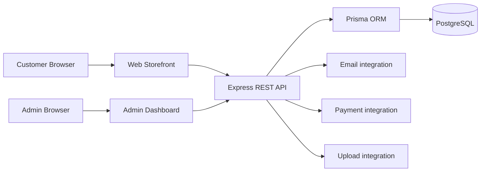
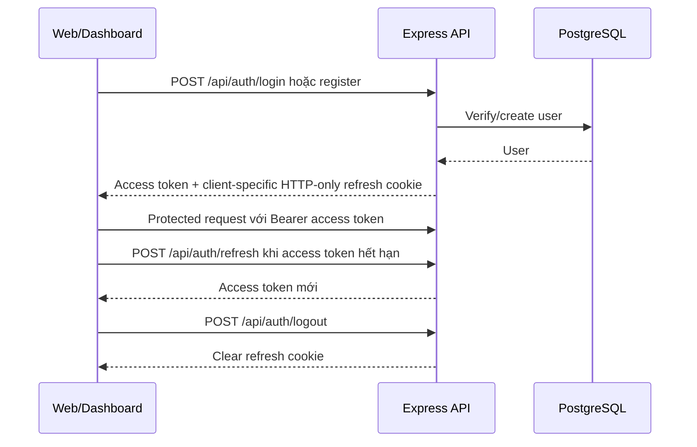
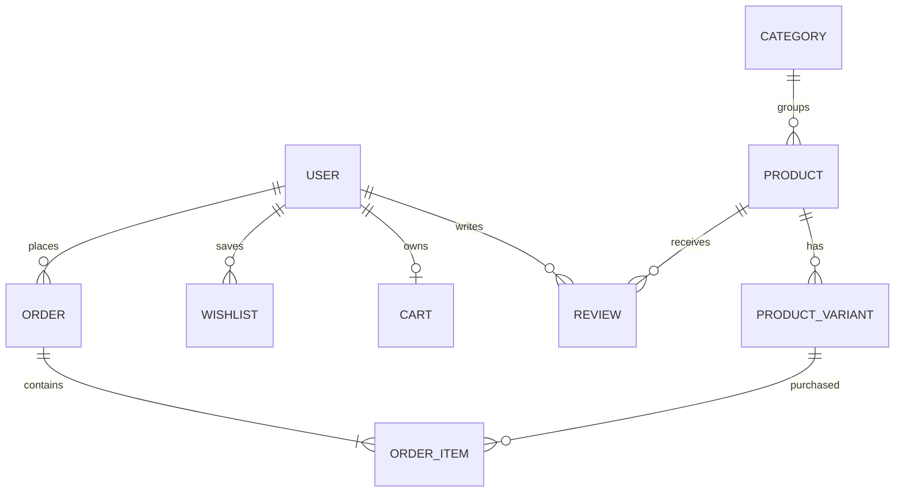
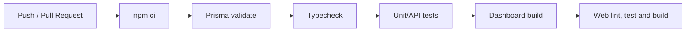

# SHOP.CO

Full-stack ecommerce platform cho thời trang, gồm storefront cho khách hàng, REST API và admin dashboard.

[](https://github.com/lnhatl1610/ecommerce/actions/workflows/ci.yml)
[](https://github.com/lnhatl1610/ecommerce/actions/workflows/web-ci.yml)


## Overview

SHOP.CO là monorepo ecommerce với ba phân hệ:

- `backend`: Express REST API, authentication, business logic và Prisma data access.
- `dashboard`: admin portal để quản lý catalog, users, orders và vận hành cửa hàng.
- `web`: customer storefront cho browsing, cart, checkout và account management.

Khách hàng thao tác trên storefront; admin quản trị dữ liệu thông qua dashboard; hai frontend giao tiếp với backend qua REST API.

## Screenshots và demo

Live demo: **Coming soon**.

Screenshots sẽ được bổ sung sau khi có build/deployment ổn định. Repository hiện chưa có thư mục `docs/images/` nên README không tạo liên kết ảnh giả.

## Features

- Authentication và role-based access.
- Product catalog, categories, search và filtering.
- Shopping cart và checkout.
- Order management và payment integration boundary.
- Wishlist, reviews và coupons.
- Customer account: profile, addresses, orders và password management.
- Admin dashboard cho users, products, categories, orders, inventory và reviews.
- JWT access token với refresh cookie tách biệt cho storefront và dashboard.

## Tech stack

| Layer | Technology |
|---|---|
| Frontend | React 19, TypeScript, Vite |
| UI | Tailwind CSS, shadcn/base UI, Lucide |
| State | Zustand, TanStack Query |
| Backend | Node.js, Express 5 |
| Database | PostgreSQL |
| ORM | Prisma |
| Validation | Zod |
| Authentication | JWT, HTTP-only refresh cookies |
| Testing | Node test, Vitest, Playwright |
| CI | GitHub Actions |
| Container | Docker |

## Architecture



Frontend applications không import trực tiếp backend; REST API là boundary giữa các phân hệ.

### Authentication flow



Storefront dùng `storefrontRefreshToken`; dashboard dùng `dashboardRefreshToken`. Việc tách cookie ngăn hai frontend chạy cùng backend host ghi đè phiên của nhau.

## Project structure

```text
ecommerce/
├── backend/
├── dashboard/
├── web/
├── docs/
├── e2e/
├── .github/
├── docker-compose.yml
├── package.json
├── AGENTS.md
└── README.md
```

Tài liệu kiến trúc và convention:

- [Architecture](docs/ARCHITECTURE.md)
- [Project structure](docs/PROJECT_STRUCTURE.md)
- [API specification](docs/API_SPEC.md)
- [Database](docs/DATABASE.md)

## Database schema



Đây là sơ đồ rút gọn; schema đầy đủ nằm trong [docs/DATABASE.md](docs/DATABASE.md) và `backend/prisma/schema.prisma`.

## Installation

### Requirements

- Node.js 22+
- npm
- PostgreSQL
- Git

### Setup

```powershell
git clone https://github.com/lnhatl1610/ecommerce.git
cd ecommerce
npm ci
npm --workspace=backend exec prisma generate
npm --workspace=backend exec prisma migrate dev
npm run dev
npm run dev:web
```

Nếu chỉ cần tạo migration hoặc cập nhật Prisma client:

```powershell
npm --workspace=backend exec prisma migrate dev
npm --workspace=backend exec prisma generate
```

## Environment configuration

Không commit secret thật. Tạo các file `.env` local từ `.env.example` tương ứng:

```powershell
Copy-Item backend/.env.example backend/.env
Copy-Item dashboard/.env.example dashboard/.env
Copy-Item web/.env.example web/.env
```

Các biến chính:

- `DATABASE_URL`
- `JWT_ACCESS_SECRET`
- `JWT_REFRESH_SECRET`
- `CORS_ORIGINS`
- `COOKIE_SECURE`
- `WEB_URL`
- Frontend API URL variables

Xem đầy đủ tại [docs/ENVIRONMENT.md](docs/ENVIRONMENT.md), [backend/.env.example](backend/.env.example), [dashboard/.env.example](dashboard/.env.example) và [web/.env.example](web/.env.example).

## Usage và ports

| Service | Port |
|---|---:|
| Backend API | `3000` |
| Dashboard | `5173` |
| Web storefront | `5174` |

```powershell
npm run dev
npm run dev:backend
npm run dev:dashboard
npm run dev:web
```

`npm run dev` khởi động backend và dashboard theo root script; chạy thêm `npm run dev:web` để mở storefront.

URLs local:

- Dashboard: <http://localhost:5173>
- Storefront: <http://localhost:5174>
- Backend health check: <http://localhost:3000/health>

## API overview

| Method | Endpoint | Description |
|---|---|---|
| `POST` | `/api/auth/login` | Đăng nhập |
| `POST` | `/api/auth/refresh` | Refresh access token |
| `GET` | `/api/products` | Danh sách sản phẩm |
| `GET` | `/api/products/:id` | Chi tiết sản phẩm |
| `GET` | `/api/cart` | Lấy cart hiện tại |
| `POST` | `/api/orders` | Tạo order |
| `GET` | `/api/account/overview` | Tổng quan account |

Khi backend đang chạy, xem và gọi thử API bằng [Swagger UI](http://localhost:3000/api-docs). Đặc tả OpenAPI được duy trì tại `backend/src/docs/openapi.ts`.

Xem toàn bộ API tại [docs/API_SPEC.md](docs/API_SPEC.md).

## Testing và CI

Các lệnh kiểm tra chính:

```powershell
npm run check
npm test
npm run test:e2e
npm --workspace=dashboard run build
npm --workspace=web run build
```

CI flow:



Chi tiết tại [docs/TESTING_STRATEGY.md](docs/TESTING_STRATEGY.md), [docs/CICD.md](docs/CICD.md), [.github/workflows/ci.yml](.github/workflows/ci.yml) và [.github/workflows/web-ci.yml](.github/workflows/web-ci.yml).

## Deployment

Repository hiện hỗ trợ local/container workflow bằng [docker-compose.yml](docker-compose.yml), [backend/Dockerfile](backend/Dockerfile) và [dashboard/Dockerfile](dashboard/Dockerfile).

Production deployment: **chưa cấu hình chính thức**. Provider như Vercel, Railway, Cloudinary hoặc S3 không được xem là active integration nếu chưa có cấu hình tương ứng trong repository.

## Roadmap

Roadmap chi tiết nằm tại [docs/ROADMAP.md](docs/ROADMAP.md):

- [x] Authentication
- [x] Product catalog
- [x] Shopping cart
- [x] Customer account foundation
- [ ] Loyalty/reward points
- [ ] Advanced payment flows
- [ ] Admin analytics
- [ ] Production deployment

## Contributing

1. Đọc [AGENTS.md](AGENTS.md) và [docs/git-workflow.md](docs/git-workflow.md).
2. Tạo branch theo convention, ví dụ `feat/account-overview` hoặc `fix/auth-refresh`.
3. Implement thay đổi và giữ commit theo Conventional Commits.
4. Chạy các checks phù hợp với workspace bị ảnh hưởng.
5. Push branch và mở Pull Request theo [template](.github/pull_request_template.md).

Không push trực tiếp vào `main`; không commit `.env`, token, credentials hoặc production data.

## Security

- Password được hash bằng bcrypt.
- Access token dùng JWT.
- Refresh token dùng HTTP-only cookies tách biệt giữa storefront và dashboard.
- Protected routes dùng role-based authorization.
- Request body được validate bằng Zod.
- API bật Helmet, CORS và rate limiting ở các flow nhạy cảm.
- User response không expose `passwordHash`.
- Secrets không được commit vào Git.

Xem [docs/SECURITY_CHECKLIST.md](docs/SECURITY_CHECKLIST.md).

## License và acknowledgements

Repository hiện chưa có `LICENSE` root chính thức. License sẽ được bổ sung sau khi project owner xác nhận.

SHOP.CO sử dụng React, Express, Prisma, PostgreSQL, Tailwind CSS, Vite và các công cụ mã nguồn mở được khai báo trong các `package.json` của monorepo.
